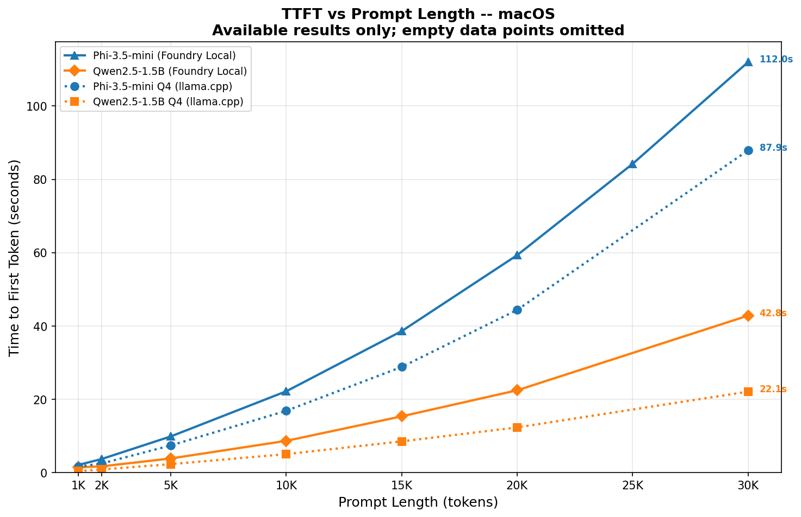
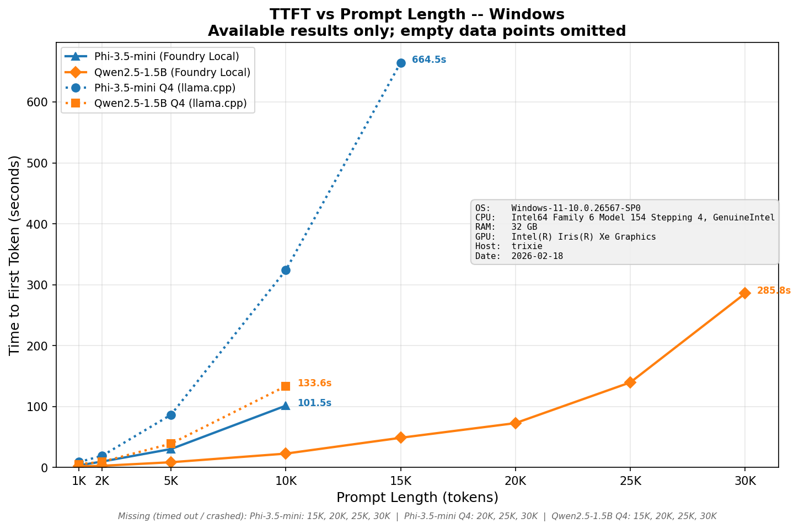

# TTFT Benchmark

A Python framework for measuring Time to First Token (TTFT) and throughput across different models and prompt lengths. Supports both **Foundry Local** and **llama.cpp** backends.

## Features

- ⏱️ Measure Time to First Token (TTFT)
- 📊 Calculate tokens per second (throughput)
- 📏 Test multiple prompt lengths
- 🔁 Run multiple iterations for statistical accuracy
- 💾 Export results to JSON and CSV
- 🔌 Support for multiple backends:
  - **Foundry Local** — automatic model download via `foundry-local-sdk`
  - **llama.cpp** — GGUF models with OpenAI-compatible server
  - ONNX Runtime GenAI (optional)
  - Any OpenAI-compatible API (Azure OpenAI, etc.)

## Prerequisites

- Python 3.9+
- [Foundry Local](https://learn.microsoft.com/en-us/azure/ai-foundry/foundry-local/get-started) installed (`foundry` CLI on PATH)
- [llama.cpp](https://github.com/ggml-org/llama.cpp) installed (optional, for GGUF testing)

### macOS

```bash
# Install Foundry Local
brew tap microsoft/foundrylocal
brew install foundrylocal

# Install llama.cpp (optional)
brew install llama.cpp
```

### Windows

```powershell
# Install Foundry Local
# Download the installer from:
# https://learn.microsoft.com/en-us/azure/ai-foundry/foundry-local/get-started
# Or use winget:
winget install Microsoft.FoundryLocal

# Install llama.cpp (optional)
# Option 1: Using winget
winget install llama.cpp

# Option 2: Download pre-built binaries
# Download from https://github.com/ggml-org/llama.cpp/releases
# Extract and add to PATH
```

## Installation

### macOS/Linux

```bash
# Create and activate a virtual environment
python3 -m venv .venv
source .venv/bin/activate

# Install dependencies
pip install -r requirements.txt
```

### Windows

```powershell
# Create and activate a virtual environment
python -m venv .venv
.venv\Scripts\Activate.ps1

# Install dependencies
pip install -r requirements.txt
```

This installs:
- `openai` — OpenAI-compatible API client
- `foundry-local-sdk` — Foundry Local model management

## Configured models

- `phi-3.5-mini` — 3.8B params, 128k context
- `qwen2.5-1.5b` — 1.5B params, fast and lightweight

### GGUF Models Required GGUF models** (download to `models/` directory):

| Model | File | Size | Source |
|-------|------|------|--------|
| Phi-3.5-mini Q4 | `Phi-3.5-mini-instruct-Q4_K_M.gguf` | ~2.2 GB | [bartowski/Phi-3.5-mini-instruct-GGUF](https://huggingface.co/bartowski/Phi-3.5-mini-instruct-GGUF) |
| Qwen2.5-1.5B Q4 | `Qwen2.5-1.5B-Instruct-Q4_K_M.gguf` | ~1.0 GB | [Qwen/Qwen2.5-1.5B-Instruct-GGUF](https://huggingface.co/Qwen/Qwen2.5-1.5B-Instruct-GGUF) |

```bash
mkdir -p models

curl -L -o models/Phi-3.5-mini-instruct-Q4_K_M.gguf \
  "https://huggingface.co/bartowski/Phi-3.5-mini-instruct-GGUF/resolve/main/Phi-3.5-mini-instruct-Q4_K_M.gguf"

curl -L -o models/Qwen2.5-1.5B-Instruct-Q4_K_M.gguf \
  "https://huggingface.co/Qwen/Qwen2.5-1.5B-Instruct-GGUF/resolve/main/qwen2.5-1.5b-instruct-q4_k_m.gguf"
```

## Reproducing the TTFT Benchmark

The `run_ttft_benchmark.py` script runs TTFT benchmarks across prompt lengths 1,000–30,000 tokens on all four model configurations. It works cross-platform (macOS, Windows, Linux). Use `generate_ttft_chart.py` to create charts from the saved results.

### Prerequisites

In addition to the base dependencies, install the charting packages:

```bash
source .venv/bin/activate
pip install matplotlib numpy
```

Ensure the GGUF models are downloaded

### Run the tests

```bash
source .venv/bin/activate

# Full run (all models, both backends)
python run_ttft_benchmark.py

# Common options
python run_ttft_benchmark.py --skip-llamacpp          # Foundry only
python run_ttft_benchmark.py --skip-foundry            # llama.cpp only
python run_ttft_benchmark.py --timeout 300             # 5-min per-iteration timeout
python run_ttft_benchmark.py --skip-model "Phi-3.5-mini Q4 (llama.cpp)"
python run_ttft_benchmark.py --merge-data results/ttft_constit_windows/ttft_data.json
```

This will:
1. Kill any stale llama-server/Foundry processes (process isolation)
2. Start llama-server for each GGUF model (with `--no-cache-prompt` to disable prompt caching)
3. Run 3 iterations × 8 prompt lengths per model (with per-iteration timeout)
4. Stop llama-server and kill processes before starting the next backend
5. Start Foundry Local, download/load each model, and run the same tests
6. Save results to `results/ttft_constit_{platform}/`

### Configuration

| CLI Argument | Default | Description |
|----------|---------|-------------|
| `--prompt-lengths` | `1000 2000 5000 10000 15000 20000 25000 30000` | Token counts to test |
| `--iterations` | `3` | Iterations per prompt length |
| `--max-tokens` | `200` | Max tokens to generate |
| `--timeout` | `300` | Per-iteration timeout in seconds |
| `--ctx-size` | `32768` | llama.cpp context size |
| `--skip-llamacpp` | `false` | Skip llama.cpp tests |
| `--skip-foundry` | `false` | Skip Foundry Local tests |
| `--skip-model` | none | Skip a specific model label (repeatable) |
| `--merge-data` | none | Path to existing ttft_data.json to merge with |
| `--output-dir` | auto | Results directory (auto-detected from platform) |

### Outputs

| File | Description |
|------|-------------|
| `results/ttft_constit_{platform}/ttft_data.json` | Raw TTFT values per model and prompt length |
| `results/ttft_constit_{platform}/system_info.json` | Machine specs (CPU, GPU, RAM, OS) |
| `results/ttft_constit_{platform}/test_run.log` | Timestamped log of all commands and results |

### Generate charts from results

```bash
# Auto-detect platform (uses current OS to find results dir)
python generate_ttft_chart.py

# Explicitly specify results directory
python generate_ttft_chart.py --results-dir results/ttft_constit_mac
python generate_ttft_chart.py --results-dir results/ttft_constit_windows
```

### Models tested

| Label | Backend | Model | Notes |
|-------|---------|-------|-------|
| Phi-3.5-mini Q4 (llama.cpp) | llama.cpp | `Phi-3.5-mini-instruct-Q4_K_M.gguf` | Q4_K_M quantization |
| Qwen2.5-1.5B Q4 (llama.cpp) | llama.cpp | `Qwen2.5-1.5B-Instruct-Q4_K_M.gguf` | Q4_K_M quantization |
| Phi-3.5-mini (Foundry Local) | Foundry Local | `phi-3.5-mini` | OpenVINO GPU EP |
| Qwen2.5-1.5B (Foundry Local) | Foundry Local | `qwen2.5-1.5b` | OpenVINO GPU EP |

### Notes

- **Prompt caching is disabled** for llama.cpp (`--no-cache-prompt`) so all iterations measure true cold-start TTFT.
- Foundry Local does not cache prompts across requests by default.
- **Process isolation**: the script kills llama-server before Foundry tests and vice versa. On Windows, uses `taskkill /F /T` for reliable process killing.
- **Timeout**: if any iteration exceeds the timeout, remaining iterations and all longer prompt lengths are skipped and marked `TIMEOUT`.
- The full test run takes approximately **30–60 minutes** depending on hardware (longer on Windows with Intel integrated graphics).
- The `prompts/` directory contains sample prompt text files (e.g. `constit.txt`) that can be used for realistic document-based testing.

## Results

### macOS Benchmark Results (February 2026)

**Hardware:** Apple Silicon (arm64), macOS 15.7.3
**Test document:** U.S. Constitution (`prompts/constit.txt`, ~11K tokens)
**Config:** 3 iterations per prompt length, 200 max tokens

### Average TTFT (seconds)

| Prompt Size | Phi-3.5-mini llama.cpp | Qwen2.5-1.5B llama.cpp | Phi-3.5-mini Foundry | Qwen2.5-1.5B Foundry |
|---|---|---|---|---|
| **1K** | 1.64 | 0.42 | 2.08 | 1.44 |
| **2K** | 2.45 | 0.83 | 3.68 | 1.69 |
| **5K** | 7.39 | 2.29 | 9.86 | 3.85 |
| **10K** | 16.85 | 5.02 | 22.17 | 8.65 |
| **15K** | 28.81 | 8.51 | 38.59 | 15.34 |
| **20K** | 44.37 | 12.32 | 59.31 | 22.45 |
| **25K** | — | — | 84.23 | — |
| **30K** | 87.90 | 22.08 | 111.99 | 42.81 |



### Key Takeaways

1. **Qwen2.5-1.5B on llama.cpp is the fastest overall** — 0.42s at 1K and just 22s at 30K. Apple Silicon's Metal backend gives llama.cpp excellent performance here, unlike on Intel integrated graphics.

2. **llama.cpp outperforms Foundry Local on Mac** — the opposite of Windows. Phi-3.5-mini llama.cpp (1.64s at 1K) beats Foundry Local (2.08s) by ~20%, and the gap widens at longer prompts.

3. **All configurations completed all prompt lengths** — no timeouts or crashes, unlike Windows where both llama.cpp models and Phi-3.5-mini Foundry failed at 15K+.

4. **Linear scaling** — TTFT scales roughly linearly with prompt length across all models, suggesting efficient memory management on Apple Silicon.

5. **Foundry Local is ~2× slower than llama.cpp for the same model** on this hardware — likely because Foundry's CoreML/ONNX backend doesn't match llama.cpp's Metal-optimized GGUF inference on Apple Silicon.

### Reproduce

```bash
source .venv/bin/activate

# Full run (all models, both backends)
python run_ttft_benchmark.py

# Regenerate chart from existing data
python generate_ttft_chart.py --results-dir results/ttft_constit_mac
```

Raw data: [`results/ttft_constit_mac/ttft_data.json`](results/ttft_constit_mac/ttft_data.json)
Full log: [`results/ttft_constit_mac/test_run.log`](results/ttft_constit_mac/test_run.log)

---

### Windows Benchmark Results (February 2026)

**Hardware:** Intel i7-12700H, Intel Iris Xe Graphics, 32 GB RAM, Windows 11 (10.0.26567)

**Test document:** U.S. Constitution (`prompts/constit.txt`, ~11K tokens)
**Config:** 3 iterations per prompt length, 200 max tokens, 5-minute per-iteration timeout

### Average TTFT (seconds)

| Prompt Size | Phi-3.5-mini llama.cpp | Qwen2.5-1.5B llama.cpp | Phi-3.5-mini Foundry | Qwen2.5-1.5B Foundry |
|---|---|---|---|---|
| **1K** | 9.05 | 5.34 | 3.57 | 1.79 |
| **2K** | 19.20 | 9.44 | 9.79 | 2.82 |
| **5K** | 86.56 | 39.15 | 30.33 | 8.66 |
| **10K** | 323.88 | 133.63 | 101.46 | 22.82 |
| **15K** | 664.52 (1 iter) | TIMEOUT | crashed | 48.79 |
| **20K** | TIMEOUT | TIMEOUT | crashed | 72.89 |
| **25K** | TIMEOUT | TIMEOUT | crashed | 139.70 |
| **30K** | TIMEOUT | TIMEOUT | crashed | 285.76 |



### Key Takeaways

1. **Foundry Local is dramatically faster than llama.cpp** on this Intel hardware — consistently 2–5× faster at every prompt length. Foundry uses the OpenVINO GPU execution provider which is well-optimized for Iris Xe.

2. **Qwen2.5-1.5B on Foundry Local is the clear winner** — the only configuration that completed all prompt lengths up to 30K. At 1K tokens it achieved **1.79s TTFT** vs 9.05s for Phi-3.5-mini on llama.cpp (5× faster).

3. **llama.cpp hits a wall at 10K–15K tokens** on this hardware — both models timed out (>5 min) at 15K. The GPU isn't well-utilized by llama.cpp on Intel integrated graphics.

4. **Phi-3.5-mini Foundry crashed at 15K** — the service dropped the connection (`WinError 10054`), likely an OOM or context-length issue with the OpenVINO model. Results at 1K–10K were solid though.

5. **Quality note:** Phi-3.5-mini Foundry produced garbled output at 5K+ tokens ("to to to..."), despite recording valid TTFT numbers. Qwen2.5-1.5B maintained coherent summaries through 30K.

6. **Variance at 30K:** Qwen Foundry's 30K had a wild 3rd iteration (503s vs ~177s avg for iters 1–2), suggesting thermal throttling or resource contention on long runs.

### Reproduce

```bash
source .venv/bin/activate

# Full run (all models, both backends)
python run_ttft_benchmark.py --timeout 300

# Regenerate chart from existing data
python generate_ttft_chart.py --results-dir results/ttft_constit_windows
```

Raw data: [`results/ttft_constit_windows/ttft_data.json`](results/ttft_constit_windows/ttft_data.json)
Full log: [`results/ttft_constit_windows/test_run.log`](results/ttft_constit_windows/test_run.log)

---

## Programmatic Usage

### Foundry Local

```python
from foundry_local import FoundryLocalManager
from test_framework import OpenAICompatibleTest

# Start service and load a model
manager = FoundryLocalManager("phi-3.5-mini")

# Run tests
tester = OpenAICompatibleTest(
    base_url=manager.endpoint,
    api_key=manager.api_key,
    output_dir="results"
)

model_info = manager.get_model_info("phi-3.5-mini")
tester.run_test(
    model_name=model_info.id,
    prompt_lengths=[100, 500, 1000, 2000],
    num_iterations=5,
    max_tokens=100
)

tester.print_summary()
tester.save_results("phi35_mini_performance")
```

### llama.cpp (manual)

```bash
# Start llama-server manually
llama-server --host 0.0.0.0 --port 8080 \
  --model models/Phi-3.5-mini-instruct-Q4_K_M.gguf \
  -ngl 99 -c 4096
```

```python
from test_framework import OpenAICompatibleTest

tester = OpenAICompatibleTest(
    base_url="http://localhost:8080/v1",
    api_key="not-needed",
    output_dir="results/llamacpp"
)

tester.run_test(
    model_name="phi3.5-mini-Q4",
    prompt_lengths=[100, 500, 1000, 2000],
    num_iterations=5,
    max_tokens=200
)

tester.print_summary()
tester.save_results("llamacpp_phi35")
```

### ONNX Runtime GenAI (optional)

```python
from test_framework import ONNXRuntimeTest

tester = ONNXRuntimeTest(output_dir="results/onnx")
tester.run_test(
    model_name="/path/to/phi-3-mini-4k-instruct-onnx",
    prompt_lengths=[10, 100, 500],
    num_iterations=5
)
```

## Output Format

### Console Output
```
Testing phi3.5-mini-Q4 with prompt length ~500 tokens
  Iteration 1/5... TTFT: 0.145s, Throughput: 87.3 t/s
  Iteration 2/5... TTFT: 0.142s, Throughput: 89.1 t/s
  ...
  Summary: TTFT avg=0.145s, Throughput avg=87.4 t/s
```

### JSON Output (detailed)
```json
[
  {
    "model_name": "phi3.5-mini-Q4",
    "prompt_length": 500,
    "iteration": 1,
    "time_to_first_token": 0.145,
    "total_time": 1.432,
    "tokens_generated": 100,
    "tokens_per_second": 87.3,
    "timestamp": "2026-02-06T20:50:00"
  }
]
```

### CSV Output
```csv
model_name,prompt_length,iteration,time_to_first_token,total_time,tokens_generated,tokens_per_second,timestamp
phi3.5-mini-Q4,500,1,0.145,1.432,100,87.3,2026-02-06T20:50:00
```

## Metrics Explained

- **Time to First Token (TTFT)**: Time from request start until the first token is generated
  - Lower is better
  - Critical for perceived responsiveness
  - Affected by: prompt length, model size, hardware acceleration

- **Tokens per Second**: Generation throughput after first token
  - Higher is better
  - Indicates sustained generation speed
  - Affected by: model size, quantization, hardware

- **Total Time**: Complete generation time for max_tokens
  - Includes TTFT + generation time

## Advanced Usage

### Custom Prompt Generation

```python
from test_framework import OpenAICompatibleTest

class CustomPromptTest(OpenAICompatibleTest):
    def generate_prompt(self, length: int) -> str:
        # Load from actual documents instead of generated text
        with open(f"test_docs/doc_{length}.txt") as f:
            return f.read()
```

### Add a Custom Model Backend

```python
from test_framework import ModelPerformanceTest

class MyCustomBackend(ModelPerformanceTest):
    def measure_inference(self, model_name, prompt, max_tokens, **kwargs):
        start = time.time()
        # ... your inference code ...
        first_token_time = time.time()
        # ... generate tokens ...
        end = time.time()

        return {
            "time_to_first_token": first_token_time - start,
            "total_time": end - start,
            "tokens_generated": count,
            "tokens_per_second": count / (end - start)
        }
```

## Project Structure

```
ttft-benchmark/
├── run_ttft_benchmark.py        # Main TTFT benchmark (cross-platform, all features)
├── generate_ttft_chart.py       # Generate chart from saved results (any platform)
├── requirements.txt             # Python dependencies
├── README.md
├── .gitignore
├── prompts/                     # Sample prompt text files
│   └── constit.txt
├── results/                     # Test output (auto-created)
│   ├── ttft_constit_mac/        # macOS benchmark results
│   │   ├── ttft_data.json
│   │   ├── ttft_chart.png
│   │   ├── ttft_macos_results.png
│   │   ├── ttft_windows_results.png
│   │   └── test_run.log
│   └── ttft_constit_windows/    # Windows benchmark results
│       ├── ttft_data.json
│       ├── ttft_chart.png
│       ├── system_info.json
│       └── test_run.log
└── .venv/                       # Virtual environment (created during installation)
```

## Troubleshooting

### Foundry Local: model not found in catalog
- Run `foundry model list` to see available model aliases
- Use aliases (e.g. `phi-3.5-mini`) not full model IDs
- Run `foundry service restart` if the service is unresponsive

### Foundry Local: connection errors
- Check service status: `foundry service status`
- Start the service: `foundry service start`
- The SDK starts the service automatically, but a restart may help

### llama.cpp: server won't start
- Verify GGUF files exist in `models/`: `ls -lh models/`
- Ensure port 8080 is free: `lsof -i :8080`
- Kill stale processes: `pkill llama-server`

### llama.cpp: slow performance
- Ensure GPU offload is enabled (`-ngl 99` for full offload)
- On Apple Silicon, Metal is used automatically
- Increase context size (`-c`) only if needed — larger contexts use more memory

### General
- Activate the virtual environment: `source .venv/bin/activate`
- Reinstall deps: `pip install -r requirements.txt`

## Tips & Best Practices

1. **Run multiple iterations** (3–5) to account for variance
2. **Warm up the model** — first run may be slower
3. **Test realistic prompt lengths** for your use case
4. **Monitor system resources** during testing
5. **Document hardware configuration** in results
6. **Compare backends** — run the same model on Foundry Local and llama.cpp to compare

## Requirements

- Python 3.9+
- openai >= 1.0.0
- foundry-local-sdk
- matplotlib (for chart generation)
- numpy (for chart generation)
- llama.cpp (optional, for GGUF testing)
- onnxruntime-genai (optional, for ONNX testing)

## License

MIT License — See repository for details
